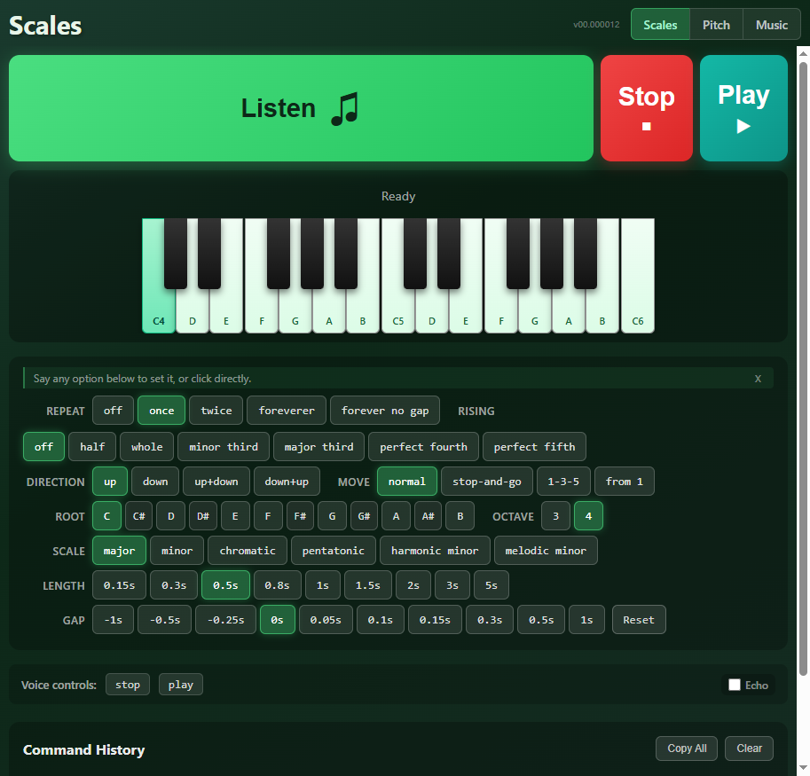
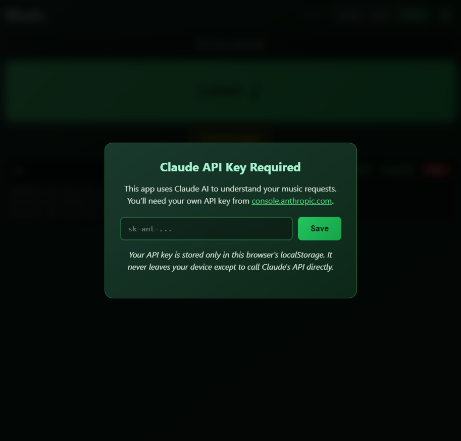

# Voice-Wei

Voice-first tools for singers, musicians, and readers.

**Main Release:** https://fuseki.net/music8899b/scales.html

## Tools

### Scales



Voice-controlled scale trainer with realistic piano sounds. Speak naturally to practice scales, intervals, and ear training.

Click **Listen**, then say:
- "D minor scale"
- "slowly chromatic"
- "G major up and down"
- "perfect fifth from A"
- "harmonic minor repeat forever"

Everything you can say is also visible and clickable. Voice commands reset to defaults then apply your modifiers, so "D minor" always sounds the same regardless of previous UI state.

**Features:**
- Salamander Grand Piano samples via Tone.js
- Phonetic aliases handle speech recognition quirks ("see" = C, "bee flat" = Bb)
- Direction, tempo, gap, repeat, octave span controls
- Live status shows current note and interval during playback
- Works on mobile (Chrome, Safari, Edge)

See [SCALES.md](SCALES.md) for full command reference.

### Pitch Meter


Real-time pitch detection for checking vocal accuracy. Select a scale, record yourself singing, see how close you hit each note.

### Music Player



Voice-controlled YouTube music player for hands-free operation. Speak your request ("play some jazz"), Claude AI interprets it, and songs appear in a playlist with comments explaining each match. Requires Claude API key (stored in browser localStorage).

### Books (Ebook Converter)

Convert ebooks to audiobooks using OpenAI's text-to-speech API.

**Supported formats:** TXT, EPUB, PDF, HTML

**Features:**
- Six voice options (Alloy, Echo, Fable, Onyx, Nova, Shimmer)
- Fast (TTS-1) or high-quality (TTS-1-HD) models
- Speed control 0.25x to 4.0x
- Download MP3 for offline use
- Requires OpenAI API key (stored in browser localStorage)

## Quick Start

```bash
python -m http.server 8000
# Visit http://localhost:8000/scales.html
```

HTTPS required for microphone access when deployed.

## Browser Support

- Chrome/Edge/Safari - Full support
- Firefox - No Web Speech API support

## Files

```
scales.html/js/css       # Scale practice
pitch-meter.html/js/css  # Pitch detection
player.html + app.js     # Music player
ebook.html/js/css        # Ebook converter
voice-command-core.js    # Shared voice recognition
```

## Version System

All pages share a unified version number:

```bash
cat VERSION              # Current version
./bump-version.sh        # Increment and update all files
./bump-version.sh 31     # Set specific version
```

## Deployment

Push to master triggers GitHub Actions deploy. Or manually:

```bash
./deploy.sh           # Deploy to server
./deploy.sh --dry-run # Preview changes
```

See [PRODUCT.md](PRODUCT.md) for detailed product documentation.

## License

Personal use project.
