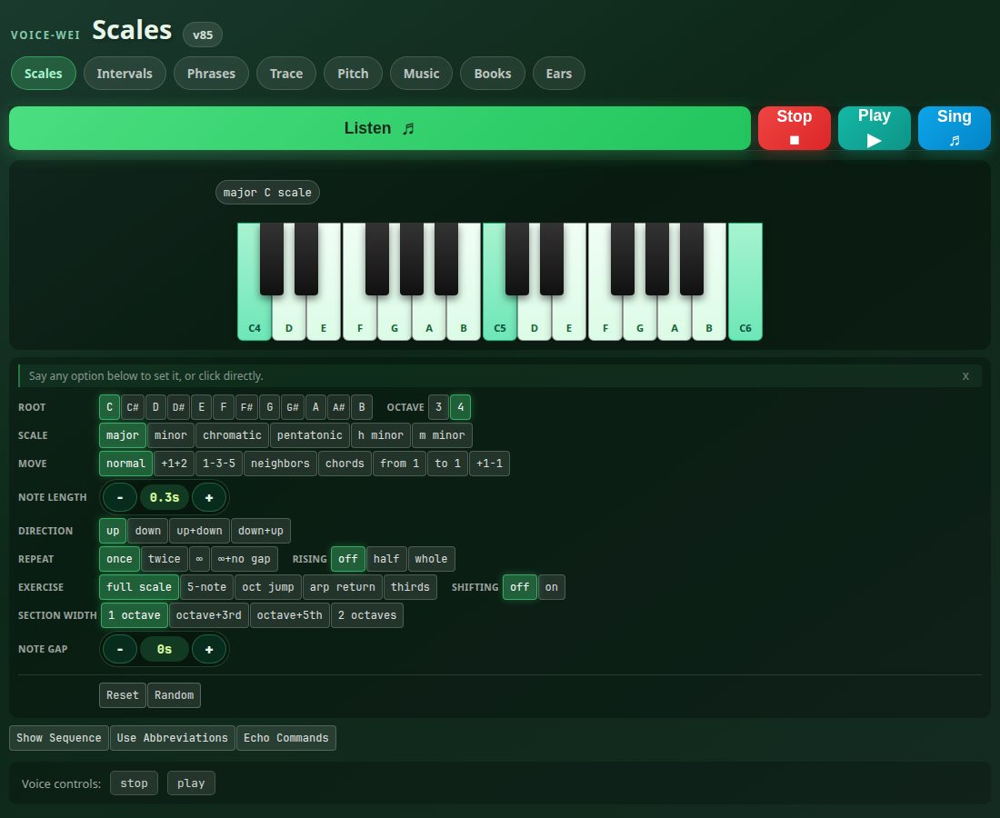
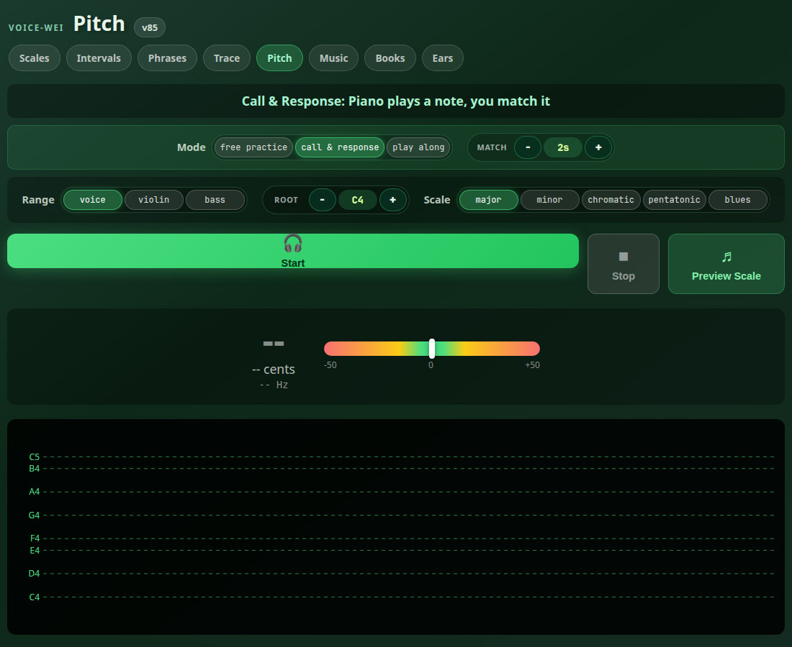
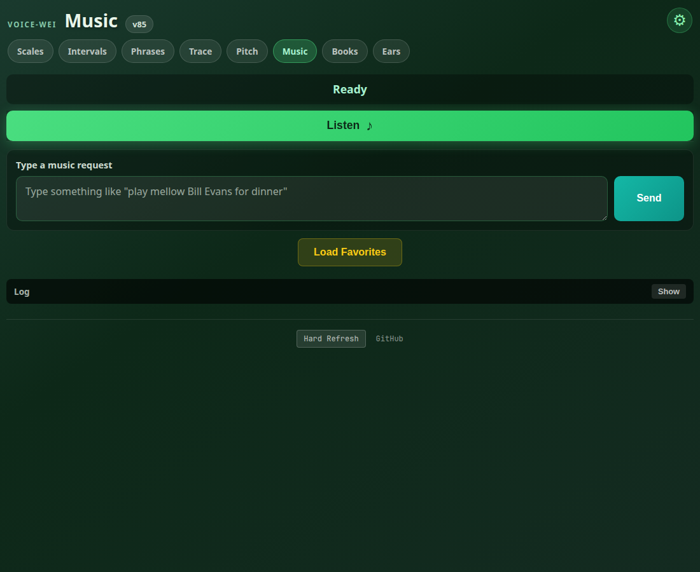

# Voice-Wei

Voice-first tools for singers, musicians, and readers.

**Main Release:** https://fuseki.net/music8899b/scales.html

## Tools

### Scales



Voice-controlled scale trainer with realistic piano sounds. Speak naturally to practice scales, intervals, and ear training.

Click **Listen**, then say:
- "D minor scale"
- "slowly chromatic"
- "G major up and down"
- "perfect fifth from A"
- "harmonic minor repeat forever"

Everything you can say is also visible and clickable. Voice commands reset to defaults then apply your modifiers, so "D minor" always sounds the same regardless of previous UI state.

**Features:**
- Salamander Grand Piano samples via Tone.js
- Phonetic aliases handle speech recognition quirks ("see" = C, "bee flat" = Bb)
- Direction, tempo, gap, repeat, octave span controls
- Live status shows current note and interval during playback
- Works on mobile (Chrome, Safari, Edge)

See [SCALES.md](SCALES.md) for full command reference.

### Phrases

Dedicated scale-degree phrase practice for singers: https://fuseki.net/music8899b/phrases.html

Use **Phrases** when the exercise is about remembering and reproducing whole melodic shapes rather than running a scale. The page is button-first; voice controls are not required to start practice.

**Default setup:** D-sharp, octave 3, 5-8 note phrases, 0.3s note length, 0.0s gap, play notes only, and return to the initial note enabled.

**Controls:**
- Root, octave, scale, start at 1/random start, within octave/out of octave
- Uniform random phrase length between selected min and max
- Return to initial note and return to scale root endings
- Output modes: display, say numbers, play tones, say + tones, sing numbers, none
- Reflect flips the current phrase around the octave so upward distances become downward distances from 8
- Per-note on/off markers under the displayed phrase let you isolate phrase sections by click or drag
- Test opens an embedded phrase pitch trace; its timeline starts only when singing is detected, and restart is silent unless guide playback is enabled
- Play plays once, Repeat loops the current phrase, Next generates a new phrase

**Setting behavior:** root, octave, and scale changes keep the current degree sequence and transpose/reproject it into the new context; structural generation settings regenerate; playback/display settings keep the current phrase and replay or redraw it.

### Test

Standalone key-aware pitch trace: https://fuseki.net/music8899b/test.html

Use **Test** when you want to sing freely in a key and see the voice trace without first generating a phrase.

**Controls:**
- Start begins microphone listening; Reset clears the trace.
- Pick root, octave, and scale to draw scale-degree rails.
- Guide interval controls the horizontal spacing for typed pattern targets.
- Type patterns like `1 2 3 5 3 1` to draw blue target bands over the live trace.
- Optional "Play guide on reset" plays the typed pattern; it is off by default.
- Extreme pitch detections outside the selected key range are discarded so one-frame high/low spikes do not clutter the chart.

### Pitch Meter



Real-time pitch detection for checking vocal accuracy. Select a scale, record yourself singing, see how close you hit each note.

### Music Player



Voice-controlled YouTube music player for hands-free operation. Speak your request ("play some jazz"), Claude AI interprets it, and songs appear in a playlist with comments explaining each match. Requires Claude API key (stored in browser localStorage).

### Books (Ebook Converter)

Convert ebooks to audiobooks using OpenAI's text-to-speech API.

**Supported formats:** TXT, EPUB, PDF, HTML

**Features:**
- Six voice options (Alloy, Echo, Fable, Onyx, Nova, Shimmer)
- Fast (TTS-1) or high-quality (TTS-1-HD) models
- Speed control 0.25x to 4.0x
- Download MP3 for offline use
- Requires OpenAI API key (stored in browser localStorage)

## Quick Start

```bash
python -m http.server 8000
# Visit http://localhost:8000/scales.html
```

HTTPS required for microphone access when deployed.

## Browser Support

- Chrome/Edge/Safari - Full support
- Firefox - No Web Speech API support

## Files

```
scales.html/js/css       # Scale practice
pitch-meter.html/js/css  # Pitch detection
player.html + app.js     # Music player
ebook.html/js/css        # Ebook converter
voice-command-core.js    # Shared voice recognition
```

## Version System

All pages share a unified version number:

```bash
cat VERSION              # Current version
./bump-version.sh        # Increment and update all files
./bump-version.sh 31     # Set specific version
```

The shared header reads the release label from `shared-header.js`, and each page keeps cache-busted local asset URLs in sync with the same version.

When a significant feature ships, always do both in the same change:
- bump the global version across the app
- push `master` so production deploy runs

## Deployment

Push to master triggers GitHub Actions deploy. Or manually:

```bash
./deploy.sh           # Deploy to server
./deploy.sh --dry-run # Preview changes
```

See [PRODUCT.md](PRODUCT.md) for detailed product documentation.

## License

Personal use project.
